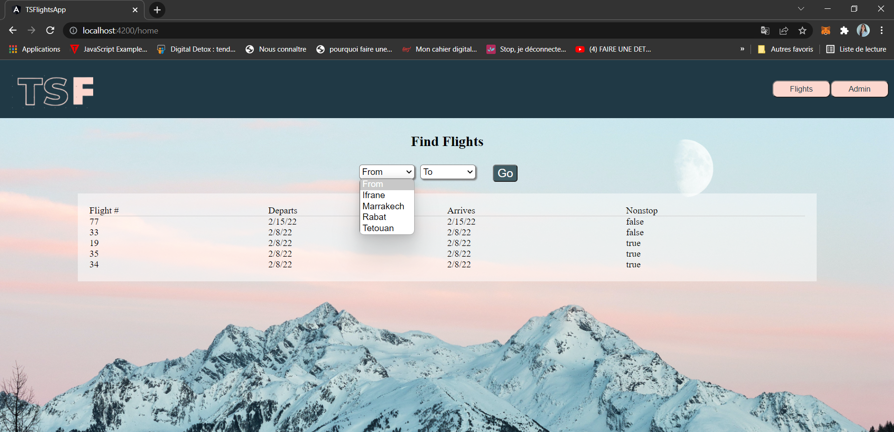
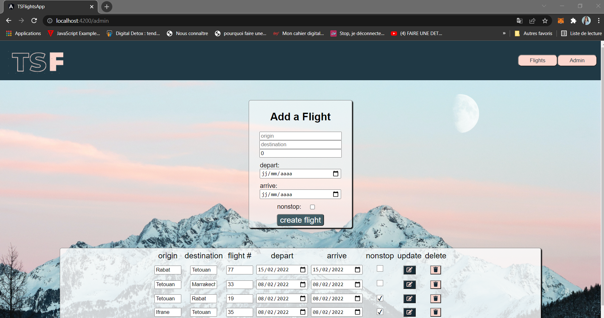

# TSFlightsApp
An app Angular that retrieve it from an API using NestJS

Home Page  
A flights page that dynamically loads all of the flights from our back-end, maps and filters out a list of possible origins and destinations, and puts those options in a select menu to search for flights

Admin Page  
An admin menu that allows us to create, read, and update all flights

Responsibe design (Home Page in mobile)

